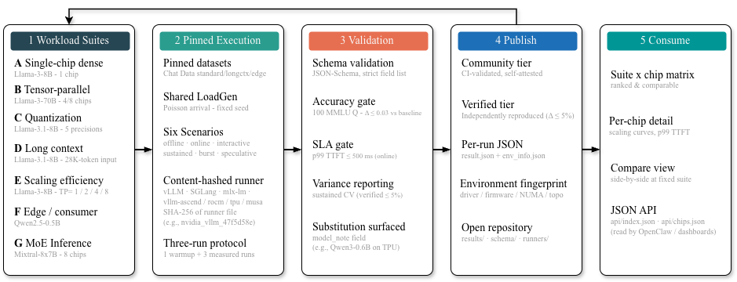
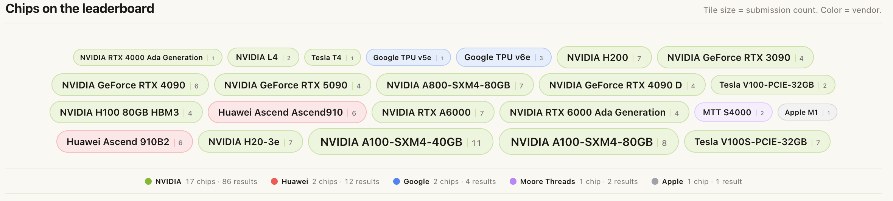

<p align="center">
  <picture>
    <source media="(prefers-color-scheme: dark)" srcset="docs/assets/logo-wordmark-dark.svg">
    
  </picture>
</p>

<p align="center">
  <strong>Open benchmark leaderboard for AI accelerators on LLM workloads.</strong>
</p>

<p align="center">
  <a href="https://freedomintelligence.github.io/AccelMark"></a>
  <a href="LICENSE"></a>
  <a href="CONTRIBUTING.md"></a>
</p>

<p align="center">
  <a href="https://freedomintelligence.github.io/AccelMark"><strong>→ Live Leaderboard</strong></a> ·
  <a href="CONTRIBUTING.md">Contributing</a> ·
  <a href="suites/README.md">Suites</a> ·
  <a href="https://github.com/FreedomIntelligence/AccelMark/discussions">Discussions</a> ·
  <a href="DEVELOPMENT.md">Development</a>
</p>

<p align="center">
  
</p>

<p align="center">
  <em>From workload spec to published result — every row on the leaderboard carries its runner hash, environment fingerprint, and accuracy receipt.</em>
</p>

---

## Why AccelMark?

| | The problem | AccelMark's answer |
|---|---|---|
| **MLPerf** | Rigorous but slow — only large vendors participate | Community runs often finish quickly (e.g. Suite A default ~11 min; Suite D default ~22 min; full all-scenarios run ~7 h) |
| **Vendor whitepapers** | Different setups make cross-vendor comparison impossible | Fixed schema + shared LoadGen = apples-to-apples |
| **Most benchmarks** | Cover only NVIDIA and only throughput | NVIDIA, AMD, Huawei Ascend, Apple Silicon — throughput, latency, scaling, quantization |

---

## Quick start

```bash
# 1. Clone and install
git clone https://github.com/FreedomIntelligence/AccelMark.git
cd AccelMark
pip install -e .                                              # installs framework dependencies (Python >=3.10 required)
pip install -r runners/nvidia_vllm_47f5d58e/requirements.txt # installs runner dependencies

# 2. One-time setup
cp configs/submitter.yaml.example configs/submitter.yaml
# Edit configs/submitter.yaml — add your name

# 3. Run the benchmark (~11 min on A100)
python run.py --runner nvidia_vllm_47f5d58e --suite suite_A

# 4. Submit your result — open a pull request:
#    git checkout -b submit/<your-hardware>
#    git add results/community/<run_name>/ && git commit -m "results: <hardware>"
#    gh pr create   # or open via the GitHub web UI
#
# <run_name> is the directory auto-created by run.py — it already contains
# your result.json and env_info.json; no manual file moves are needed.
```

See [CONTRIBUTING.md](CONTRIBUTING.md) for the full guide. If you'd rather skip the PR workflow, [open a submission issue](https://github.com/FreedomIntelligence/AccelMark/issues/new?template=community_submission.md) instead and a bot will draft the PR for you.

---

## Suites

| Suite | Model | Chips | Question answered | Primary metric |
|-------|-------|-------|-------------------|----------------|
| **A** | Llama-3-8B | 1 | How fast is this chip at inference? | Offline tokens/sec |
| **B** | Llama-3-70B | flexible | Can this chip serve large models? | Offline tokens/sec |
| **C** | Llama-3.1-8B | 1 | Quantization speed/quality tradeoff? | Speedup vs BF16 |
| **D** | Llama-3.1-8B | 1 | How does this chip handle long-context (28K) inputs? | Offline tokens/sec |
| **E** | Llama-3-8B | 1×/2×/4×/8× | How well does this chip scale? | Scaling efficiency |
| **F** | Qwen2.5-0.5B | 1 | How fast is this consumer/edge GPU? | Offline tokens/sec |
| **G** | Mixtral-8x7B-Instruct | ≥2 (auto) | How efficiently does this chip handle sparse MoE inference? | Offline tokens/sec |

Suites A, B, and D also include optional **speculative decoding** and/or **burst load** extra scenarios — see [suites/README.md](suites/README.md) for per-suite details.

See [suites/README.md](suites/README.md) for full specs, time budgets, SLA definitions, and metric descriptions.

---

## Currently on the leaderboard

<p align="center">
  
</p>

A snapshot of accelerators that have at least one submission on the leaderboard. Tile size is proportional to submission count; colour denotes vendor. See the [**live leaderboard**](https://freedomintelligence.github.io/AccelMark) for current rankings, per-suite breakdowns, and the underlying `result.json` files.

---

## Supported platforms

Reference runners live under `runners/` (see each folder’s `meta.json`). The table below is **auto-generated** from each runner's `meta.json` — never hand-edited. Add a runner, declare its `suite_support` in `meta.json`, and the matrix updates on its own.

<!-- platforms-matrix:start -->
| Hardware | Runner folder | Framework | A | B | C | D | E | F | G |
|---|---|---|:-:|:-:|:-:|:-:|:-:|:-:|:-:|
| NVIDIA GPU | `nvidia_sglang_c43a8309` | SGLang | ✓ | ✓ | ✓ | ✓ | ✓ | ✓ | ✓ |
| NVIDIA GPU | `nvidia_vllm020_0f6c56e4` | vLLM | ⋯ | ⋯ | ⋯ | ⋯ | ⋯ | ⋯ | ⋯ |
| NVIDIA GPU | `nvidia_vllm_47f5d58e` | vLLM | ✓ | ✓ | ✓ | ✓ | ✓ | ✓ | ✓ |
| NVIDIA V100 (SM70) | `nvidia_onecat_vllm_12a253c2` | 1Cat-vLLM | ⋯ | ⋯ | ⋯ | ⋯ | ⋯ | — | ⋯ |
| AMD GPU | `amd_vllm_rocm_6c18cd8f` | vLLM-ROCm | ✓ | ✓ | ✓ | ✓ | ✓ | ✓ | ✓ |
| Huawei Ascend NPU | `ascend_vllm_ascend_d4aa9fda` | vllm-ascend | ✓ | ✓ | ✓ | ✓ | ✓ | — | — |
| Apple Silicon | `apple_mlx_lm_9546b8b5` | mlx-lm | ⋯ | — | — | ⋯ | — | ⋯ | — |
| Google TPU | `google_vllm_tpu_68cc9ffa` | vllm-tpu | ✓ | — | — | ✓ | — | ✓ | — |
| Moore Threads GPU | `moorethreads_vllm_musa_f2f6f965` | vllm-musa | ✓ | ⋯ | ⋯ | ⋯ | ⋯ | ✓ | — |

_Legend: ✓ validated · ⋯ author-declared (not smoke-tested in this repo yet) · — unsupported._
<!-- platforms-matrix:end -->

> Regenerate locally with `python tools/generate_platforms_matrix.py`. CI runs `--check` and fails the PR if the README and runner metadata disagree.

Other stacks (TensorRT-LLM, MindIE, mlx-lm, etc.) can be added as new runner folders; see the contributor guide.

Adding a new runner? See [CONTRIBUTING.md#adding-a-new-runner](CONTRIBUTING.md#adding-a-new-runner). Adding a new accelerator family? See [`runners/README.md`](runners/README.md#adding-a-new-accelerator-family).

---

## Leaderboard tiers

| Tier | How | Where |
|------|-----|-------|
| **community** | Submitted by anyone via PR (or issue → bot-drafted PR) and passes CI validation | Community tab |
| **verified** | Independently reproduced on the same hardware/runner and matches the original within 5% | Main leaderboard |

Community results are fully visible and comparable — they just haven't been independently reproduced yet. Anyone with the listed hardware can promote a community result to verified by submitting a reproduction PR.

---

## Contributing

The most valuable contribution is running the benchmark on hardware not yet in the leaderboard.

- **Submit a result** → [Submitting a result](CONTRIBUTING.md#submitting-a-result)
- **Add a new runner** → [Adding a new runner](CONTRIBUTING.md#adding-a-new-runner)
- **Add a new accelerator family** → [Platform plug-in guide](runners/README.md#adding-a-new-accelerator-family)
- **Report a bug** → [Open an issue](https://github.com/FreedomIntelligence/AccelMark/issues/new?template=bug_report.md)
- **Ask a question / share results** → [Discussions](https://github.com/FreedomIntelligence/AccelMark/discussions)
- **Extend the leaderboard** → [Development guide](DEVELOPMENT.md)

> _Optional:_ AccelMark also ships a small voice-driven launcher for the [OpenClaw](https://clawhub.ai) ecosystem — see [`openclaw_skill/`](openclaw_skill/README.md). It's not required to run, contribute, or submit results.

---

## Citation

If you use AccelMark results in research, please cite:

```bibtex
@misc{accelmark2026,
  title  = {Beyond NVIDIA! A  Multi-Regime Framework for Benchmarking Heterogeneous AI Accelerators},
  author = {Liang, Juhao and Zhang, Zhiyuan and Li, Siyu and Lin, Zhihang and Yu, Minchen and Zeng, Li and Chen, Zizhong and Sun, Ruoyu and Wang, Benyou},
  year   = {2026},
  url    = {https://github.com/FreedomIntelligence/AccelMark}
}
```

---

## License

Apache 2.0 — see [LICENSE](LICENSE).
Submitted benchmark results are contributed under [CC BY 4.0](https://creativecommons.org/licenses/by/4.0/).
Bundled third-party data (datasets, accuracy subsets) keeps its upstream license — see [NOTICE](NOTICE).